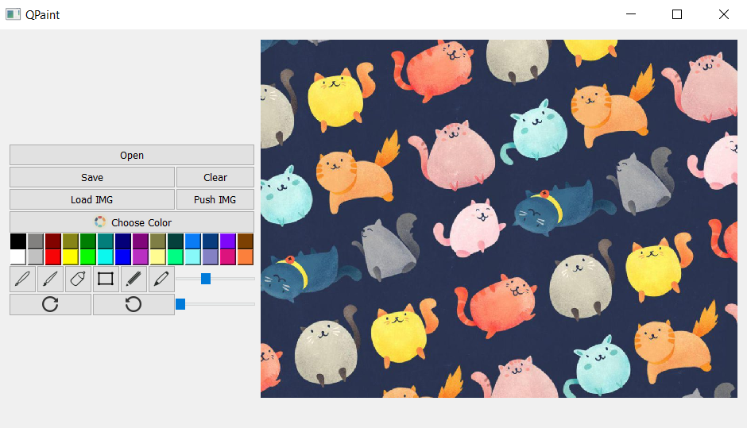

# QtPaint
Растовый редактор изображений

### Функционал
  - Загрузка  / сохранение изображений
  - Задание и изменение размеров холста
  - Разные инструменты и их настройка
  - Выбор палитры

### Запуск 
```
python main.py
```

### Изображение


### Зависимости
- Python3
- PyQt5

### Автор
Ремша Игорь, 2019
